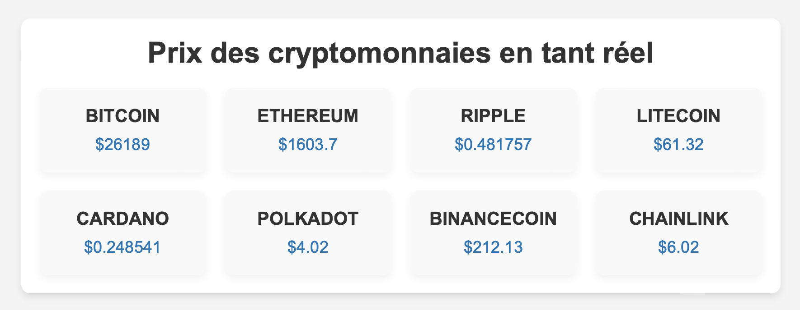

# Suivi des prix des cryptomonnaies en JavaScript

Un outil de suivi en temps réel des prix des cryptomonnaies, construit en utilisant JavaScript, HTML et CSS. Avec cette application, les utilisateurs peuvent suivre les variations de prix de 8 cryptomonnaies du marché. Le but est d'avoir une vue d'ensemble des mouvements de prix en un seul endroit, en temps réel.

## Fonctionnalités

- Affichage en temps réel des prix de 8 cryptomonnaies.
- Mise à jour automatique des prix toutes les 60 secondes.
- Présentation élégante avec des cartes pour chaque cryptomonnaie.

## Captures d'écran

## Comment utiliser l'outil

1. Ouvrez le fichier `index.html` dans votre navigateur web.
2. Observez les prix des cryptomonnaies mises à jour en temps réel.
3. Revérifiez régulièrement pour suivre les mouvements du marché.

## Personnalisation

Vous pouvez personnaliser cette application en modifiant le code JavaScript pour suivre d'autres cryptomonnaies, ajuster la fréquence des mises à jour, ou changer le style d'affichage. Vous pouvez également ajouter des fonctionnalités supplémentaires comme des alertes de prix, des graphiques historiques, etc.

## Contribution

Les contributions sont les bienvenues ! Si vous souhaitez améliorer cette application ou ajouter de nouvelles fonctionnalités, n'hésitez pas à soumettre une demande de tirage (pull request).
